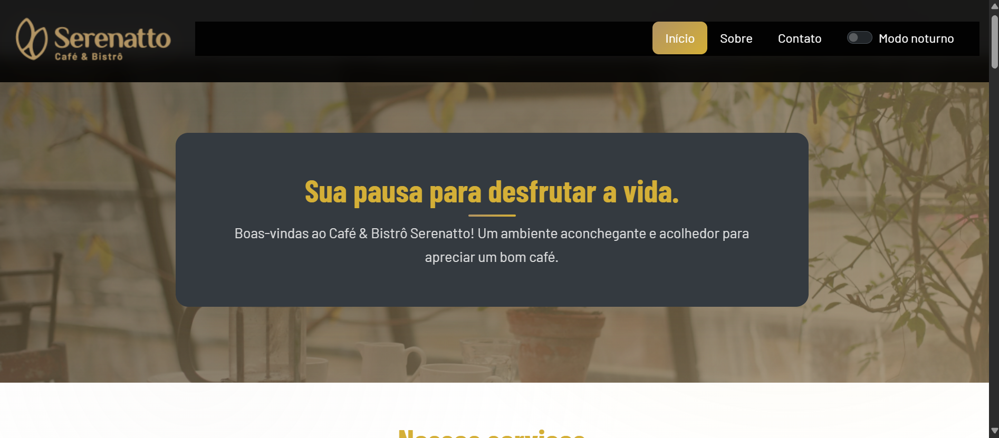
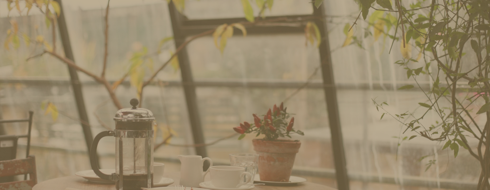
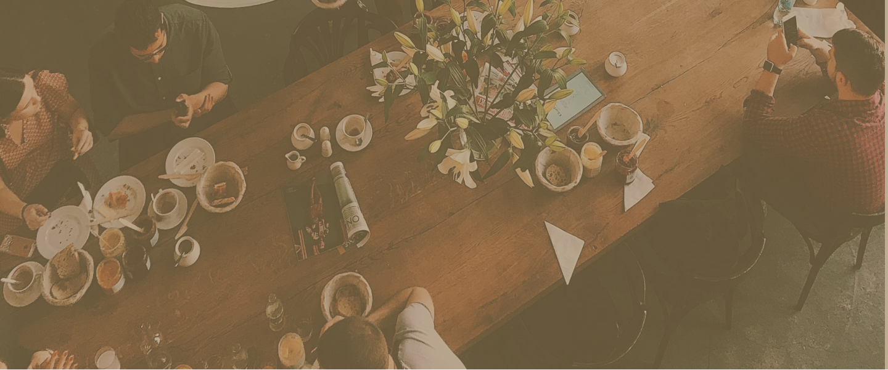
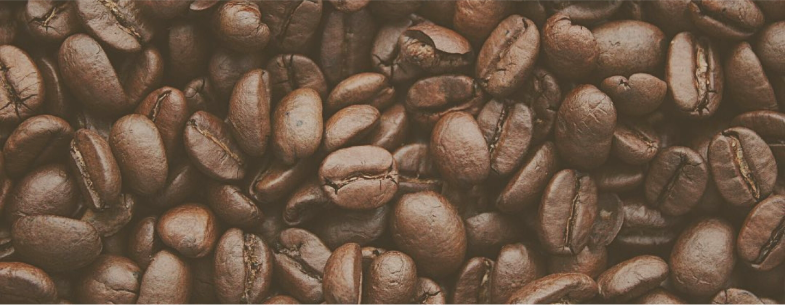

# ☕ Serenatto - Café & Bistrô

<div align="center">
  
  
  [](https://bistro-serenatto.vercel.app)
  []()
  []()
  []()
  []()
</div>

## 🌟 Sobre o Projeto

**Serenatto** é um site elegante e profissional desenvolvido para um café & bistrô fictício, focando na experiência do usuário e design moderno. O projeto combina HTML5 semântico, CSS3 avançado e JavaScript interativo para criar uma presença digital sofisticada e envolvente.

### 🎯 Objetivo
Criar uma identidade digital premium que reflita a qualidade e o ambiente acolhedor do café, oferecendo aos visitantes uma experiência imersiva que os convide a conhecer o estabelecimento.

---

## ✨ Funcionalidades

### 🎨 **Design & Visual**
- **Design System Completo**: Paleta de cores coesa com tons terrosos e dourados
- **Tipografia Responsiva**: Sistema fluido que se adapta a qualquer tela
- **Animações Suaves**: Transições elegantes sem comprometer a performance
- **Glassmorphism**: Efeitos de vidro fosco em elementos chave
- **Dark/Light Mode**: Alternância de tema com persistência local

### 🏗️ **Arquitetura & Layout**
- **Mobile-First**: Design responsivo otimizado para dispositivos móveis
- **Grid System**: Layout flexível usando Bootstrap 5.3
- **Navbar Inteligente**: Navegação fixa com efeitos de scroll
- **Seções Interativas**: Cards com hover effects e micro-interações

### 📋 **Componentes Principais**
- **Hero Section**: Banner principal com call-to-action
- **Serviços**: Cards informativos sobre Café & Bistrô, Buffet e Delivery
- **Produtos**: Galeria interativa com modal de detalhes
- **Formulário de Contato**: Sistema completo com validação e feedback
- **Footer**: Informações de contato e redes sociais

### 🛠️ **Interatividade**
- **Range Slider**: Avaliação visual com estrelas
- **Formulário Dinâmico**: Validação em tempo real e mensagens de sucesso
- **Offcanvas Menu**: Menu lateral responsivo
- **Modais Informativos**: Detalhes dos produtos em overlay

---

## 🚀 Tecnologias Utilizadas

### **Frontend Core**
- **HTML5**: Estrutura semântica e acessível
- **CSS3**: Estilização avançada com Custom Properties
- **JavaScript ES6+**: Interatividade e manipulação do DOM

### **Frameworks & Bibliotecas**
- **Bootstrap 5.3**: Framework CSS responsivo
- **Bootstrap Icons**: Iconografia consistente
- **Google Fonts**: Tipografia premium (Barlow & Barlow Condensed)

### **Recursos Avançados**
- **CSS Variables**: Sistema de design escalável
- **Flexbox & Grid**: Layouts modernos e flexíveis
- **LocalStorage**: Persistência de preferências do usuário
- **Media Queries**: Responsividade total

### **Performance & SEO**
- **Otimização de Imagens**: Formatos adequados e compressão
- **Meta Tags**: Configuração completa para SEO
- **Favicon**: Identidade visual no navegador

---

## 📱 Responsividade

| Dispositivo | Resolução | Layout |
|------------|-----------|---------|
| Mobile | 320px - 768px | Stack vertical, menu colapsável |
| Tablet | 768px - 1024px | Grid adaptativo, 2 colunas |
| Desktop | 1024px+ | Layout completo, 3+ colunas |

---

## 🎨 Design System

### **Paleta de Cores**
```css
--primary-beige: #E6E0D6    /* Background suave */
--primary-brown-dark: #816D4F  /* Texto principal */
--primary-brown-light: #B29463 /* Elementos secundários */
--accent-gold: #D4AF37      /* Destaques e CTAs */
--accent-cream: #F5F2E8     /* Backgrounds claros */
```

### **Tipografia**
- **Headings**: Barlow Condensed (700)
- **Body Text**: Barlow (400, 600)
- **Tamanhos**: Sistema clamp() responsivo

### **Espaçamento**
- **Sistema 8px**: Múltiplos de 8 para consistência
- **CSS Variables**: Manutenção centralizada

---

## 📁 Estrutura do Projeto

```
CafeteriaSerenatto/
├── Serenatto/
│   ├── index.html          # Página principal
│   ├── estilos.css         # Estilos principais
│   ├── script.js           # JavaScript interativo
│   └── assets/             # Recursos visuais
│       ├── logo.png
│       ├── logo-mobile.png
│       ├── favicon.png
│       ├── banner-[1-3].png
│       ├── *-card.png
│       └── produtos-*.png
├── README.md               # Documentação
├── LICENSE                 # Licença do projeto
└── imgcafe-demo.png        # Screenshot demo
```

---

## 🛠️ Como Executar

### **Pré-requisitos**
- Navegador web moderno
- Servidor local (opcional para desenvolvimento)

### **Instalação Simples**
```bash
# Clone o repositório
git clone https://github.com/seu-usuario/CafeteriaSerenatto.git

# Navegue até a pasta
cd CafeteriaSerenatto/Serenatto

# Abra no navegador
open index.html
```

### **Desenvolvimento Local**
```bash
# Com Python
python -m http.server 8000

# Com Node.js
npx serve .

# Com PHP
php -S localhost:8000
```

Acesse: `http://localhost:8000`

---

## 📊 Performance

### **Métricas**
- ⚡ **Carregamento**: < 2s (3G)
- 📱 **Mobile Score**: 95+
- ♿ **Acessibilidade**: AA compliant
- 🎯 **SEO Score**: 90+

### **Otimizações**
- Imagens comprimidas e otimizadas
- CSS e JS minificados
- Fontes carregadas assincronamente
- Lazy loading implementado

---

## 🔧 Customização

### **Cores**
Altere as variáveis CSS em `:root` para personalizar a paleta:

```css
:root {
  --primary-beige: #sua-cor;
  --accent-gold: #sua-cor;
  /* ... outras variáveis */
}
```

### **Conteúdo**
- **Textos**: Edite diretamente no `index.html`
- **Imagens**: Substitua arquivos na pasta `assets/`
- **Estilos**: Modifique `estilos.css` seguindo a estrutura existente

---

## 🤝 Contribuição

1. **Fork** o projeto
2. **Crie** uma branch para sua feature (`git checkout -b feature/AmazingFeature`)
3. **Commit** suas mudanças (`git commit -m 'Add some AmazingFeature'`)
4. **Push** para a branch (`git push origin feature/AmazingFeature`)
5. **Abra** um Pull Request

---

## 📄 Licença

Este projeto está licenciado sob a licença MIT. Veja o arquivo [LICENSE](LICENSE) para mais detalhes.

---

## 📞 Contato

**Desenvolvido com ❤️ por [Seu Nome]**

[](https://linkedin.com/in/seu-perfil)
[](https://github.com/seu-usuario)
[](mailto:seu-email@email.com)

---

<div align="center">
  
  ### 🌟 Se este projeto foi útil, considere dar uma ⭐!
  
  **[🚀 Ver Demo](https://bistro-serenatto.vercel.app)** • **[📝 Reportar Bug](../../issues)** • **[💡 Sugerir Feature](../../issues)**

</div>

---

## 📸 Screenshots



### 📱 Mobile Views
<div align="center">
  
  
  
</div>
